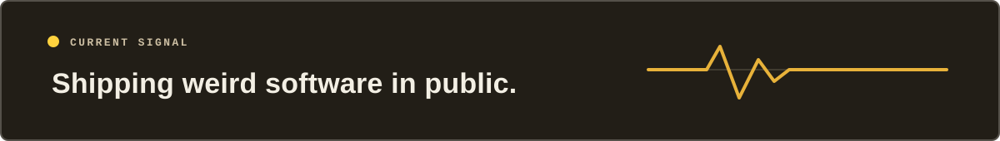

  

  <a href="https://avenox.lol"><b>avenox.lol</b></a>
  &nbsp;&nbsp;·&nbsp;&nbsp;
  <a href="https://www.youtube.com/@avenoxai"><b>YouTube / @avenoxai</b></a>
  &nbsp;&nbsp;·&nbsp;&nbsp;
  <a href="https://x.com/Avenoxai"><b>X / @Avenoxai</b></a>

 

## What I am building now

<table>
  <tr>
    <td valign="top">
      FLAGSHIP / IN ACTIVE DEVELOPMENT
      <h2><a href="https://serai.run">Serai</a></h2>
      
<strong>The neutral control plane for every AI agent.</strong>

      

        AI agents are powerful, but the infrastructure around them is still broken:
        sessions start without the right memory, context stays trapped inside separate tools,
        risky actions lack consistent gates, and there is rarely a reliable record of what ran or why.
      

      

        Serai sits outside the model and gives Claude Code, Codex, Cursor, Hermes, and other agents
        a shared layer for scoped memory, compiled context, governed tool routing, human approvals,
        action receipts, workflows, and version history.
      

      

        It does not replace the agent or run the intelligence. It makes the same agent more reliable,
        inspectable, and able to carry work across sessions, tools, and teams.
      

      

        <strong>Serai is currently being built in private. It will be open-sourced in the future.</strong>
      

      

        <a href="https://serai.run"><b>serai.run</b></a>
        &nbsp;&nbsp;·&nbsp;&nbsp;
        <a href="https://app.serai.run"><b>live hub</b></a>
      

    </td>
  </tr>
</table>

 

<table>
  <tr>
    <td width="68%" valign="middle">
      <h2>Building what watches.</h2>
      

        I build AI systems, agent infrastructure, and strange little products in public.
        The polished explanations live on YouTube. The raw prompts, model outputs, failures,
        and working code live here.
      

      

        <code>AI SYSTEMS</code>&nbsp;
        <code>AGENT INFRA</code>&nbsp;
        <code>MODEL TESTS</code>&nbsp;
        <code>OPEN BUILDS</code>
      

    </td>
    <td width="32%" align="center" valign="middle">
      
       
      <b>THE LEMON</b> · quality control
    </td>
  </tr>
</table>

 

## Selected builds

<table>
  <tr>
    <td width="50%" valign="top">
      BUILD / 01
      <h3><a href="https://github.com/avenoxai/avenoxbeyin">avenoxbeyin</a></h3>
      
An AI second brain in one command. Obsidian + Claude Code with persistent memory across sessions.

      
<code>SHELL</code> · <b>13 ★</b>

    </td>
    <td width="50%" valign="top">
      BUILD / 02
      <h3><a href="https://github.com/avenoxai/sessizkes">sessizkeş</a></h3>
      
Finds, previews, and cuts silence in clips. A fully local macOS app built for the actual editing loop.

      
<code>TYPESCRIPT</code> · <b>3 ★</b>

    </td>
  </tr>
  <tr>
    <td width="50%" valign="top">
      BUILD / 03
      <h3><a href="https://github.com/avenoxai/kapalicarsi">kapalıçarşı</a></h3>
      
A live bargaining game. You run the stall; the customer is an AI with a budget, patience, and attitude.

      
<code>JAVASCRIPT</code>

    </td>
    <td width="50%" valign="top">
      BUILD / 04
      <h3><a href="https://github.com/avenoxai/candylovable">candylovable</a></h3>
      
Prompt-to-playable match-3 builder. Describe a game and get a live Pixi board.

      
<code>TYPESCRIPT</code>

    </td>
  </tr>
</table>

 

## The model lab

> Same prompt. Different frontier models. One self-contained HTML file each. 
> Nothing quietly fixed after the model finished.

| Test archive | What is inside |
| --- | --- |
| **[🍋 limon-arena](https://github.com/avenoxai/limon-arena)** | The growing archive of raw frontier-model tests from the videos |
| **[AI Ne Kadar İlerledi?](https://github.com/avenoxai/AI-Ne-Kadar-Ilerledi)** | 2023 → 2026 across four one-shot visualization tasks |
| **[Sonnet 5 vs Opus 4.8](https://github.com/avenoxai/sonnet5-vs-opus)** | Five identical prompts and both models' untouched output |
| **[GPT-5.6 SOL Benchmark](https://github.com/avenoxai/GPT-5.6-SOL-Benchmark)** | Four single-file demos with their original prompts |

 

  

  Everything from the videos lives here — raw, inspectable, exactly as it ran.

