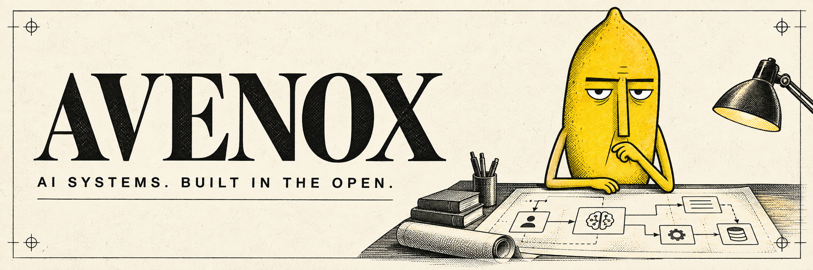

  

  <a href="https://avenox.lol"><b>Website</b></a> &nbsp; / &nbsp;
  <a href="https://www.youtube.com/@avenoxai"><b>YouTube</b></a> &nbsp; / &nbsp;
  <a href="https://x.com/Avenoxai"><b>X</b></a> &nbsp; / &nbsp;
  <a href="mailto:taha@avenox.lol"><b>Get in touch</b></a>

 

I’m **Taha, a.k.a. Avenox**. I build agent systems, test models on real tasks, and share the tools behind my work.

On [YouTube](https://www.youtube.com/@avenoxai), I walk through the process in Turkish. Here, you can explore the code, reuse the skills, and inspect the experiments for yourself.

## Start here

<table>
  <tr>
    <td width="50%" valign="top">
      01 / MEMORY
      <h3><a href="https://github.com/avenoxai/avenoxbeyin">Avenox Beyin</a></h3>
      
An open-source second brain built around Obsidian and Claude Code. Keep useful context across sessions.

      
<a href="https://github.com/avenoxai/avenoxbeyin"><b>Build your second brain →</b></a>

    </td>
    <td width="50%" valign="top">
      02 / WORKFLOWS
      <h3><a href="https://github.com/avenoxai/avenoxskills">Avenox Skills</a></h3>
      
Reusable agent skills from my day-to-day work: coding fleets, reviews, research, and video production.

      
<a href="https://github.com/avenoxai/avenoxskills"><b>Explore the skills →</b></a>

    </td>
  </tr>
  <tr>
    <td width="50%" valign="top">
      03 / EXPERIMENTS
      <h3><a href="https://github.com/avenoxai/limon-arena">Limon Arena</a></h3>
      
Raw frontier-model experiments from the videos. Original prompts and outputs, ready to inspect.

      
<a href="https://github.com/avenoxai/limon-arena"><b>See what the models made →</b></a>

    </td>
    <td width="50%" valign="top">
      04 / WATCH THE PROCESS
      <h3><a href="https://www.youtube.com/@avenoxai">Avenox on YouTube</a></h3>
      
Hands-on builds, model comparisons, and the practical work of turning AI tools into useful systems.

      
<a href="https://www.youtube.com/@avenoxai"><b>Watch the builds →</b></a>

    </td>
  </tr>
</table>

## On the workbench: Serai

**A shared control plane for AI agents.**

I’m building Serai to connect memory, context, tools, approvals, and execution records across agent workflows. The aim is continuity: useful work should carry across sessions, tools, and teams.

**In active development.** The codebase is currently private.

[Explore Serai](https://serai.run) · [Open the hub](https://app.serai.run)

## A few experiments to open

| Experiment | What to look for |
| :--- | :--- |
| [AI Ne Kadar İlerledi?](https://github.com/avenoxai/AI-Ne-Kadar-Ilerledi) | Models from different generations tackling the same visualization tasks. |
| [Sonnet 5 vs Opus 4.8](https://github.com/avenoxai/sonnet5-vs-opus) | Identical prompts, with both models’ original outputs. |
| [GPT-5.6 SOL Benchmark](https://github.com/avenoxai/GPT-5.6-SOL-Benchmark) | Single-file demos and the prompts that produced them. |
| [Galaxy simulation](https://github.com/avenoxai/galaxy-simulation) | A browser-based Milky Way experiment. |

 

---

  <b>Build. Test. Inspect. Share.</b> 
  For collaborations and sponsorships: <a href="mailto:taha@avenox.lol">taha@avenox.lol</a>

